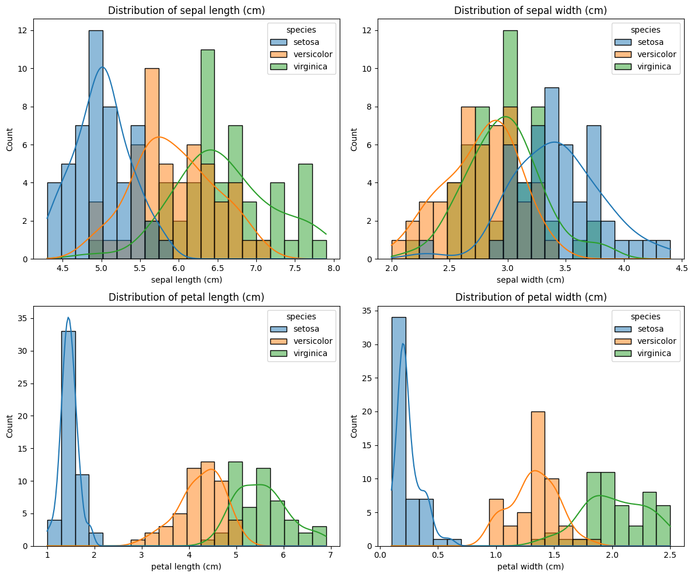
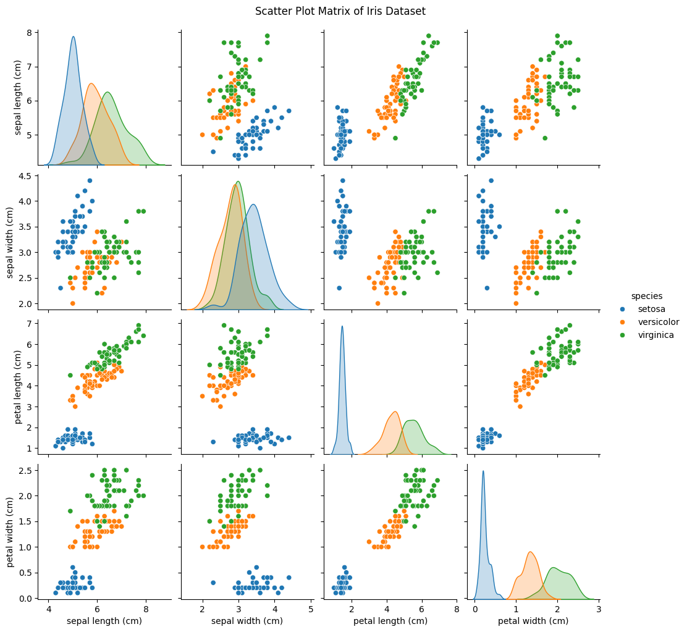
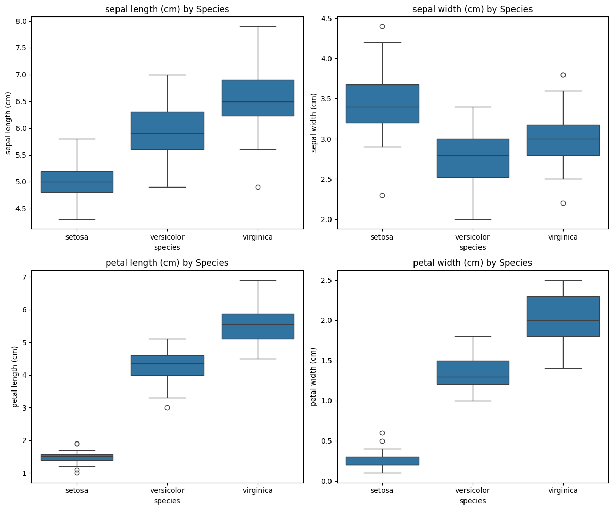
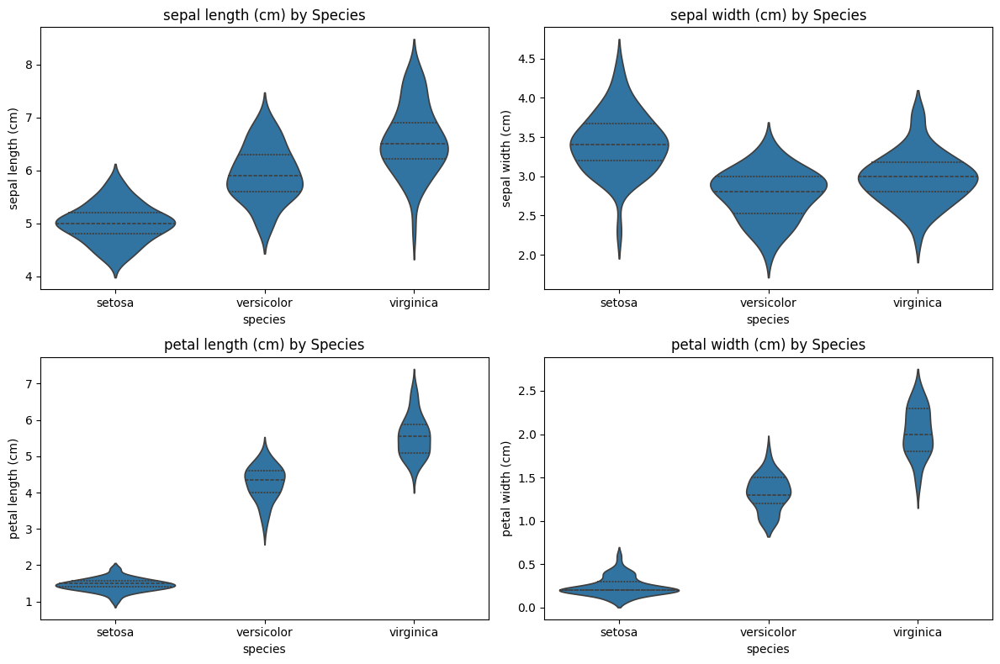
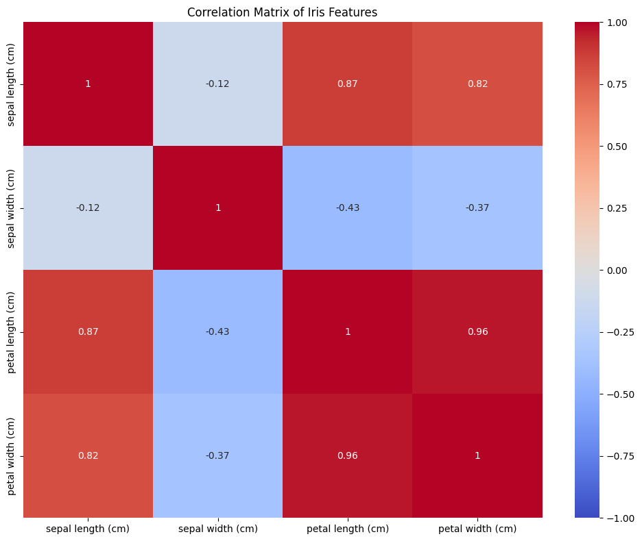
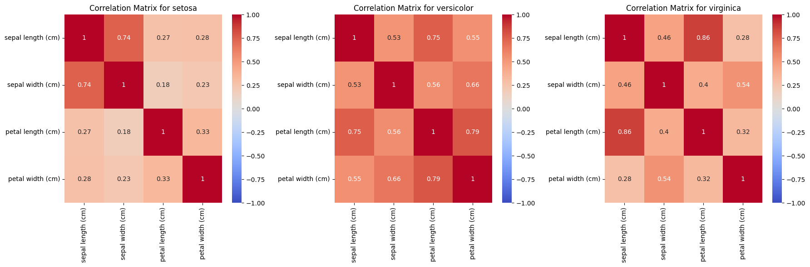
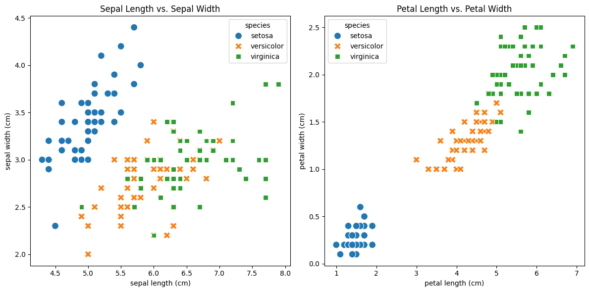
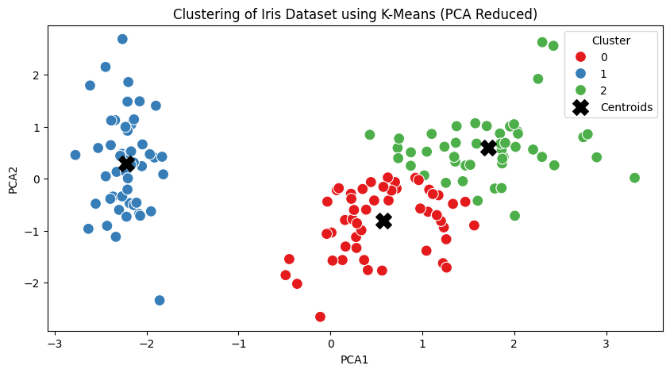
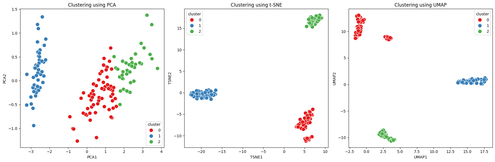

# IRIS Data Analysis

## My To-Do List
1. تحميل قاعدة البيانات
2. طباعة البداية والنهاية والمعلومات عن قاعدة البيانات
3. تمثيل قاعدة البيانات بالرسومات
4. تهيئة قاعدة البيانات للتحليل
5. تحليل قاعدة البيانات
6. كتابة الملاحظة

# التدريب
- التركيز على استيراد البيانات
- تمثيل البيانات
- تطبيق النظريات السابقة
- اضافة هذا العمل الى جيت هوب

# التدريب
يجب فهم قاعدة البيانات قبل البدء يجب ان نعرف ماذا تعني هذه البيانات
---


### الخطوة الاولى: بناء نظرة عامة على البيانات


```python
# المكتبات المستخدمة في المشروع
import pandas as pd
import numpy as np
import matplotlib.pyplot as plt
import seaborn as sns
from scipy import stats
from sklearn.cluster import KMeans
from sklearn.preprocessing import StandardScaler
from sklearn.decomposition import PCA
```


```python
# Load the Iris dataset
from sklearn.datasets import load_iris
iris = load_iris()
iris_df = pd.DataFrame(data=iris.data, columns=iris.feature_names)
iris_df['species'] = pd.Categorical.from_codes(iris.target, iris.target_names)

# Display the first few rows
print("First 5 rows of the Iris dataset:")
print(iris_df.head())

# Check the shape of the dataset
print(f"\nDataset shape: {iris_df.shape}")
```

    First 5 rows of the Iris dataset:
       sepal length (cm)  sepal width (cm)  petal length (cm)  petal width (cm)  \
    0                5.1               3.5                1.4               0.2   
    1                4.9               3.0                1.4               0.2   
    2                4.7               3.2                1.3               0.2   
    3                4.6               3.1                1.5               0.2   
    4                5.0               3.6                1.4               0.2   
    
      species  
    0  setosa  
    1  setosa  
    2  setosa  
    3  setosa  
    4  setosa  
    
    Dataset shape: (150, 5)


```python
iris_df
```


<div>
<style scoped>
    .dataframe tbody tr th:only-of-type {
        vertical-align: middle;
    }

    .dataframe tbody tr th {
        vertical-align: top;
    }

    .dataframe thead th {
        text-align: right;
    }
</style>
<table border="1" class="dataframe">
  <thead>
    <tr style="text-align: right;">
      <th></th>
      <th>sepal length (cm)</th>
      <th>sepal width (cm)</th>
      <th>petal length (cm)</th>
      <th>petal width (cm)</th>
      <th>species</th>
    </tr>
  </thead>
  <tbody>
    <tr>
      <th>0</th>
      <td>5.1</td>
      <td>3.5</td>
      <td>1.4</td>
      <td>0.2</td>
      <td>setosa</td>
    </tr>
    <tr>
      <th>1</th>
      <td>4.9</td>
      <td>3.0</td>
      <td>1.4</td>
      <td>0.2</td>
      <td>setosa</td>
    </tr>
    <tr>
      <th>2</th>
      <td>4.7</td>
      <td>3.2</td>
      <td>1.3</td>
      <td>0.2</td>
      <td>setosa</td>
    </tr>
    <tr>
      <th>3</th>
      <td>4.6</td>
      <td>3.1</td>
      <td>1.5</td>
      <td>0.2</td>
      <td>setosa</td>
    </tr>
    <tr>
      <th>4</th>
      <td>5.0</td>
      <td>3.6</td>
      <td>1.4</td>
      <td>0.2</td>
      <td>setosa</td>
    </tr>
    <tr>
      <th>...</th>
      <td>...</td>
      <td>...</td>
      <td>...</td>
      <td>...</td>
      <td>...</td>
    </tr>
    <tr>
      <th>145</th>
      <td>6.7</td>
      <td>3.0</td>
      <td>5.2</td>
      <td>2.3</td>
      <td>virginica</td>
    </tr>
    <tr>
      <th>146</th>
      <td>6.3</td>
      <td>2.5</td>
      <td>5.0</td>
      <td>1.9</td>
      <td>virginica</td>
    </tr>
    <tr>
      <th>147</th>
      <td>6.5</td>
      <td>3.0</td>
      <td>5.2</td>
      <td>2.0</td>
      <td>virginica</td>
    </tr>
    <tr>
      <th>148</th>
      <td>6.2</td>
      <td>3.4</td>
      <td>5.4</td>
      <td>2.3</td>
      <td>virginica</td>
    </tr>
    <tr>
      <th>149</th>
      <td>5.9</td>
      <td>3.0</td>
      <td>5.1</td>
      <td>1.8</td>
      <td>virginica</td>
    </tr>
  </tbody>
</table>
<p>150 rows × 5 columns</p>
</div>


#### Check Data balance.


```python
iris_df["species"].value_counts() 
```


    species
    setosa        50
    versicolor    50
    virginica     50
    Name: count, dtype: int64


#### Check for missing values


```python
print("\nMissing values:")
print(iris_df.isnull().sum())
```

    
    Missing values:
    sepal length (cm)    0
    sepal width (cm)     0
    petal length (cm)    0
    petal width (cm)     0
    species              0
    dtype: int64


```python
# Get basic information about the dataset
print("\nDataset info:")
print(iris_df.info())
```

    
    Dataset info:
    <class 'pandas.core.frame.DataFrame'>
    RangeIndex: 150 entries, 0 to 149
    Data columns (total 5 columns):
     #   Column             Non-Null Count  Dtype   
    ---  ------             --------------  -----   
     0   sepal length (cm)  150 non-null    float64 
     1   sepal width (cm)   150 non-null    float64 
     2   petal length (cm)  150 non-null    float64 
     3   petal width (cm)   150 non-null    float64 
     4   species            150 non-null    category
    dtypes: category(1), float64(4)
    memory usage: 5.1 KB
    None


 نلاحظ ان الانواع جميعها عددية عدا الاخير فنوعه فئوي


```python
# Summary statistics
print("\nSummary statistics:")
print(iris_df.describe())
```

    
    Summary statistics:
           sepal length (cm)  sepal width (cm)  petal length (cm)  \
    count         150.000000        150.000000         150.000000   
    mean            5.843333          3.057333           3.758000   
    std             0.828066          0.435866           1.765298   
    min             4.300000          2.000000           1.000000   
    25%             5.100000          2.800000           1.600000   
    50%             5.800000          3.000000           4.350000   
    75%             6.400000          3.300000           5.100000   
    max             7.900000          4.400000           6.900000   
    
           petal width (cm)  
    count        150.000000  
    mean           1.199333  
    std            0.762238  
    min            0.100000  
    25%            0.300000  
    50%            1.300000  
    75%            1.800000  
    max            2.500000  


**نلاحظ هنا**
- Count: عدد القيم غير الفارغة (القيم التي تحتوي على بيانات) في العمود.
- Mean: المتوسط الحسابي (القيمة المتوسطة) للعمود.
- Std: الانحراف المعياري للعمود.
- Min: أقل قيمة في العمود.
- 25%: الربيع الأول (النسبة المئوية الـ 25)، أي 25% من البيانات أقل من هذه القيمة.
- 50%: الوسيط (الربيع الثاني)، وهو القيمة التي تفصل البيانات إلى نصفين متساويين.
- 75%: الربيع الثالث (النسبة المئوية الـ 75)، أي 75% من البيانات أقل من هذه القيمة.
- Max: أكبر قيمة في العمود.


```python
# Count of each species
print("\nSpecies distribution:")
print(iris_df['species'].value_counts())
```

    
    Species distribution:
    species
    setosa        50
    versicolor    50
    virginica     50
    Name: count, dtype: int64


### الخطوة الثانية : تمثيل البيانات بالرسوم


```python
# Create histograms for each feature
plt.figure(figsize=(12, 10))
for i, feature in enumerate(iris.feature_names):
    plt.subplot(2, 2, i+1)
    sns.histplot(data=iris_df, x=feature, hue='species', kde=True, bins=20)
    plt.title(f'Distribution of {feature}')
plt.tight_layout()
plt.show()

# Create a scatter plot matrix
sns.pairplot(iris_df, hue='species', diag_kind='kde')
plt.suptitle('Scatter Plot Matrix of Iris Dataset', y=1.02)
plt.show()

# Create box plots for each feature by species
plt.figure(figsize=(12, 10))
for i, feature in enumerate(iris.feature_names):
    plt.subplot(2, 2, i+1)
    sns.boxplot(x='species', y=feature, data=iris_df)
    plt.title(f'{feature} by Species')
plt.tight_layout()
plt.show()

# Create a violin plot
plt.figure(figsize=(12, 8))
for i, feature in enumerate(iris.feature_names):
    plt.subplot(2, 2, i+1)
    sns.violinplot(x='species', y=feature, data=iris_df, inner='quartile')
    plt.title(f'{feature} by Species')
plt.tight_layout()
plt.show()
```


    

    


    

    


    

    


    

    


### الخطوة الثالثة: دراسة العلاقات بين الاعمدة والعمود الهدف الذي اخترناه


*حساب مصفوفة الارتباط*

1: ارتباط إيجابي قوي (زيادة في العمود الأول تعني زيادة في العمود الثاني).

-1: ارتباط سلبي قوي (زيادة في العمود الأول تعني انخفاض في العمود الثاني).

0: لا يوجد ارتباط.

--- 
اللون الأحمر/الأزرق: يشير إلى الارتباطات القوية (إيجابي أو سلبي).

اللون الأبيض أو الألوان الباهتة: تشير إلى ارتباط ضعيف أو عدم وجود ارتباط.

القيم الرقمية في الخلايا: هي قيم الارتباط الفعلي بين الأعمدة.


```python
# Calculate correlation matrix
correlation_matrix = iris_df.drop(columns=['species']).corr()

# Visualize the correlation matrix
plt.figure(figsize=(10, 8))
sns.heatmap(correlation_matrix, annot=True, cmap='coolwarm', vmin=-1, vmax=1)
plt.title('Correlation Matrix of Iris Features')
plt.tight_layout()
plt.show()

# Analyze correlation by species
species_names = iris_df['species'].unique()
fig, axes = plt.subplots(1, 3, figsize=(18, 6))

for i, species in enumerate(species_names):
    subset = iris_df[iris_df['species'] == species].drop(columns=['species'])
    corr = subset.corr()
    sns.heatmap(corr, annot=True, cmap='coolwarm', vmin=-1, vmax=1, ax=axes[i])
    axes[i].set_title(f'Correlation Matrix for {species}')

plt.tight_layout()
plt.show()
```


    

    


    

    


```python
# Calculate descriptive statistics by species
stats_by_species = iris_df.groupby('species').describe()
print("Descriptive statistics by species:")
print(stats_by_species)
# Perform ANOVA to compare means across species


for feature in iris.feature_names:
    # Create groups for ANOVA
    groups = [iris_df[iris_df['species'] == species][feature] for species in species_names]
    
    # Perform ANOVA
    f_stat, p_value = stats.f_oneway(*groups)
    
    print(f"\nANOVA for {feature}:")
    print(f"F-statistic: {f_stat:.4f}")
    print(f"p-value: {p_value:.4f}")
    print(f"Significant difference: {'Yes' if p_value < 0.05 else 'No'}")
```

    Descriptive statistics by species:
               sepal length (cm)                                              \
                           count   mean       std  min    25%  50%  75%  max   
    species                                                                    
    setosa                  50.0  5.006  0.352490  4.3  4.800  5.0  5.2  5.8   
    versicolor              50.0  5.936  0.516171  4.9  5.600  5.9  6.3  7.0   
    virginica               50.0  6.588  0.635880  4.9  6.225  6.5  6.9  7.9   
    
               sepal width (cm)         ... petal length (cm)       \
                          count   mean  ...               75%  max   
    species                             ...                          
    setosa                 50.0  3.428  ...             1.575  1.9   
    versicolor             50.0  2.770  ...             4.600  5.1   
    virginica              50.0  2.974  ...             5.875  6.9   
    
               petal width (cm)                                            
                          count   mean       std  min  25%  50%  75%  max  
    species                                                                
    setosa                 50.0  0.246  0.105386  0.1  0.2  0.2  0.3  0.6  
    versicolor             50.0  1.326  0.197753  1.0  1.2  1.3  1.5  1.8  
    virginica              50.0  2.026  0.274650  1.4  1.8  2.0  2.3  2.5  
    
    [3 rows x 32 columns]
    
    ANOVA for sepal length (cm):
    F-statistic: 119.2645
    p-value: 0.0000
    Significant difference: Yes
    
    ANOVA for sepal width (cm):
    F-statistic: 49.1600
    p-value: 0.0000
    Significant difference: Yes
    
    ANOVA for petal length (cm):
    F-statistic: 1180.1612
    p-value: 0.0000
    Significant difference: Yes
    
    ANOVA for petal width (cm):
    F-statistic: 960.0071
    p-value: 0.0000
    Significant difference: Yes


    /var/folders/f7/wjsg2sjd4lj9xj4j4lvdskq40000gn/T/ipykernel_12910/1806527599.py:2: FutureWarning: The default of observed=False is deprecated and will be changed to True in a future version of pandas. Pass observed=False to retain current behavior or observed=True to adopt the future default and silence this warning.
      stats_by_species = iris_df.groupby('species').describe()


و اختبار إحصائي يُستخدم لمقارنة المتوسطات بين أكثر من مجموعتين. في هذه الحالة، يتم استخدام اختبار ANOVA لمقارنة المتوسطات بين الأنواع المختلفة في مجموعة البيانات (Setosa, Versicolor, Virginica) في خصائص معينة (مثل طول السيبال، عرض السيبال، إلخ).

### إحصائية F (F-statistic)  
تقيس مدى التباين بين المجموعات مقارنة بالتباين داخل المجموعات. إذا كانت قيمة **F** كبيرة، فهذا يشير إلى أن الفروق بين المجموعات قد تكون كبيرة.  

### القيمة p (p-value)  
تحدد ما إذا كان الفرق بين المجموعات ذو دلالة إحصائية. إذا كانت **p-value** أقل من **0.05**، فهذا يشير إلى وجود فرق معنوي بين المجموعات.  
بمعنى آخر، إذا كانت **p-value** أقل من **0.05**، نرفض الفرضية الصفرية (التي تنص على عدم وجود فرق بين المجموعات) ونقبل الفرضية البديلة (التي تشير إلى وجود فرق معنوي بين المجموعات).  

### النتيجة  
يتم طباعة **إحصائية F** و **p-value**، وإذا كانت **p-value < 0.05**، يتم طباعة **"Yes"** للإشارة إلى وجود فرق معنوي بين المتوسطات، وإلا يتم طباعة **"No"**.  

### الفائدة من هذا التحليل  
- **الإحصائيات الوصفية** توفر معلومات أساسية حول البيانات، مثل المتوسط والانحراف المعياري لكل نوع.  
- **اختبار ANOVA** يساعد في تحديد ما إذا كانت هناك فروقات معنوية بين الأنواع في الخصائص المختلفة.  
  مثلاً، إذا وُجدت فروق معنوية في **طول السيبال** بين الأنواع الثلاثة، فقد يكون ذلك مؤشرًا على إمكانية التمييز بين الأنواع بناءً على هذه الخاصية.  


### الخطوة الثالثة: استخلاص النتائج


```python
# Create a summary visualization
plt.figure(figsize=(12, 6))

# Plot sepal length vs. sepal width
plt.subplot(1, 2, 1)
sns.scatterplot(x='sepal length (cm)', y='sepal width (cm)', 
                hue='species', style='species', s=100, data=iris_df)
plt.title('Sepal Length vs. Sepal Width')

# Plot petal length vs. petal width
plt.subplot(1, 2, 2)
sns.scatterplot(x='petal length (cm)', y='petal width (cm)', 
                hue='species', style='species', s=100, data=iris_df)
plt.title('Petal Length vs. Petal Width')

plt.tight_layout()
plt.show()

# Print key findings
print("\nKey Findings from Iris Dataset Analysis:")
print("1. Iris setosa is clearly separable from the other two species based on petal measurements")
print("2. Iris virginica and Iris versicolor have some overlap but can be distinguished")
print("3. Petal length and petal width show the strongest correlation")
print("4. Petal measurements are more useful than sepal measurements for species identification")
print("5. All features show statistically significant differences across species")
```


    

    


    
    Key Findings from Iris Dataset Analysis:
    1. Iris setosa is clearly separable from the other two species based on petal measurements
    2. Iris virginica and Iris versicolor have some overlap but can be distinguished
    3. Petal length and petal width show the strongest correlation
    4. Petal measurements are more useful than sepal measurements for species identification
    5. All features show statistically significant differences across species


*الهدف من هذا التصور*

مقارنة أنماط الأنواع المختلفة: يساعد التلوين (hue='species') والتنسيق (style='species') في التعرف على كيفية توزيع الأنواع المختلفة في العلاقة بين المتغيرات.

فهم الفصل بين الأنواع:

إذا كانت الأنواع متجمعة في مناطق منفصلة في الرسم البياني، فهذا يشير إلى أنها يمكن تمييزها بسهولة بناءً على هذه الخصائص.

إذا كانت الأنواع متداخلة، فقد يكون من الصعب التمييز بينها باستخدام هذه الخصائص فقط.
### المتغيرات الأكثر تميزًا بين الأنواع يمكن استخدامها في نماذج التصنيف مثل SVM أو Decision Trees.

## تطبيق خوارزميات التجميع (Clustering) لتحديد الأنواع الثلاثة في مجموعة بيانات Iris

قبل تطبيق K-Means، من الجيد تطبيع البيانات (Scaling) باستخدام StandardScaler لتحسين أداء الخوارزمية.


```python
# تطبيع البيانات (تحويلها إلى نفس المقياس)
scaler = StandardScaler()
iris_scaled = scaler.fit_transform(iris_df.iloc[:, :-1])  # استبعاد عمود 'species'

# تطبيق K-Means مع k=3 (عدد الأنواع في البيانات الأصلية)
kmeans = KMeans(n_clusters=3, random_state=42, n_init=10)
clusters = kmeans.fit_predict(iris_scaled)

# إضافة نتائج التجميع إلى DataFrame
iris_df['cluster'] = clusters

# عرض أول 5 صفوف مع التجمعات
print(iris_df.head())

```

       sepal length (cm)  sepal width (cm)  petal length (cm)  petal width (cm)  \
    0                5.1               3.5                1.4               0.2   
    1                4.9               3.0                1.4               0.2   
    2                4.7               3.2                1.3               0.2   
    3                4.6               3.1                1.5               0.2   
    4                5.0               3.6                1.4               0.2   
    
      species  cluster  
    0  setosa        1  
    1  setosa        1  
    2  setosa        1  
    3  setosa        1  
    4  setosa        1  


```python
# تقليل الأبعاد إلى 2 باستخدام PCA
pca = PCA(n_components=2)
iris_pca = pca.fit_transform(iris_scaled)

# إضافة المكونات الرئيسية إلى DataFrame
iris_df['PCA1'] = iris_pca[:, 0]
iris_df['PCA2'] = iris_pca[:, 1]

# رسم التجمعات
plt.figure(figsize=(10, 5))

# رسم النقاط مع الألوان حسب التجمعات
sns.scatterplot(x='PCA1', y='PCA2', hue='cluster', palette='Set1', s=100, data=iris_df)


# رسم مراكز التجمعات
centers = pca.transform(kmeans.cluster_centers_)
plt.scatter(centers[:, 0], centers[:, 1], c='black', marker='X', s=200, label='Centroids')

plt.title("Clustering of Iris Dataset using K-Means (PCA Reduced)")
plt.legend(title="Cluster")
plt.show()

```


    

    


```python
# مقارنة التجمعات بالأنواع الحقيقية
comparison = pd.crosstab(iris_df['species'], iris_df['cluster'], rownames=['Actual'], colnames=['Cluster'])
comparison

```


<div>
<style scoped>
    .dataframe tbody tr th:only-of-type {
        vertical-align: middle;
    }

    .dataframe tbody tr th {
        vertical-align: top;
    }

    .dataframe thead th {
        text-align: right;
    }
</style>
<table border="1" class="dataframe">
  <thead>
    <tr style="text-align: right;">
      <th>Cluster</th>
      <th>0</th>
      <th>1</th>
      <th>2</th>
    </tr>
    <tr>
      <th>Actual</th>
      <th></th>
      <th></th>
      <th></th>
    </tr>
  </thead>
  <tbody>
    <tr>
      <th>setosa</th>
      <td>0</td>
      <td>50</td>
      <td>0</td>
    </tr>
    <tr>
      <th>versicolor</th>
      <td>39</td>
      <td>0</td>
      <td>11</td>
    </tr>
    <tr>
      <th>virginica</th>
      <td>14</td>
      <td>0</td>
      <td>36</td>
    </tr>
  </tbody>
</table>
</div>


📌 تحليل كل صف:
كل صف يمثل نوعًا من الزهور في البيانات الأصلية (Actual)، وكل عمود (Cluster) يمثل مجموعة حددها نموذج K-Means.

Setosa (الصف الأول)

جميع عينات setosa (عددها 50) تم وضعها في المجموعة 1 (Cluster 1).

هذا يعني أن K-Means تعرف بدقة 100% على هذا النوع! 👍

Versicolor (الصف الثاني)

تم تصنيف 39 زهرة من versicolor في المجموعة 0 (Cluster 0).

بينما تم تصنيف 11 زهرة منها بالخطأ في المجموعة 2 (Cluster 2).

K-Means واجه صعوبة في الفصل التام بين versicolor و virginica.

Virginica (الصف الثالث)

تم تصنيف 36 زهرة من virginica في المجموعة 2 (Cluster 2).

ولكن 14 زهرة منها تم تصنيفها بالخطأ ضمن المجموعة 0 (Cluster 0).

هذا يشير إلى تداخل بين versicolor و virginica، مما جعل K-Means يخطئ في تصنيف بعض العينات.

استنتاجات:

✅ نجاح تام مع setosa
📉 خلط بين versicolor و virginica بسبب التشابه بينهما في بعض الخصائص.

🔹 السبب:

setosa متميزة جدًا عن باقي الأنواع، لذا حددها K-Means بدقة.

versicolor و virginica لديهما بعض التشابه، مما أدى إلى بعض الأخطاء.

### استخدام تقنية اخرى لحل المشكلة
📌 الخطوات الرئيسية:
تحميل بيانات Iris.

تطبيق K-Means لتقسيم البيانات إلى 3 مجموعات.

تطبيق t-SNE وتقليل الأبعاد إلى بعدين (2D).

تطبيق UMAP لتقليل الأبعاد إلى بعدين (2D).

رسم النتائج باستخدام Seaborn.


```python
# تحميل بيانات Iris
iris_df['species'] = iris.target  # إضافة العمود الحقيقي للأنواع

# تطبيق K-Means (عدد المجموعات = 3)
kmeans = KMeans(n_clusters=3, random_state=42, n_init=10)
iris_df['cluster'] = kmeans.fit_predict(iris_df.iloc[:, :-1])
tsne = TSNE(n_components=2, perplexity=30, random_state=42)
iris_df[['TSNE1', 'TSNE2']] = tsne.fit_transform(iris_df.iloc[:, :-2])  # استبعاد الأعمدة غير العددية
iris_df
```


<div>
<style scoped>
    .dataframe tbody tr th:only-of-type {
        vertical-align: middle;
    }

    .dataframe tbody tr th {
        vertical-align: top;
    }

    .dataframe thead th {
        text-align: right;
    }
</style>
<table border="1" class="dataframe">
  <thead>
    <tr style="text-align: right;">
      <th></th>
      <th>sepal length (cm)</th>
      <th>sepal width (cm)</th>
      <th>petal length (cm)</th>
      <th>petal width (cm)</th>
      <th>species</th>
      <th>cluster</th>
      <th>PCA1</th>
      <th>PCA2</th>
      <th>TSNE1</th>
      <th>TSNE2</th>
    </tr>
  </thead>
  <tbody>
    <tr>
      <th>0</th>
      <td>5.1</td>
      <td>3.5</td>
      <td>1.4</td>
      <td>0.2</td>
      <td>0</td>
      <td>2</td>
      <td>-2.264703</td>
      <td>0.480027</td>
      <td>-24.714949</td>
      <td>-3.083350</td>
    </tr>
    <tr>
      <th>1</th>
      <td>4.9</td>
      <td>3.0</td>
      <td>1.4</td>
      <td>0.2</td>
      <td>0</td>
      <td>2</td>
      <td>-2.080961</td>
      <td>-0.674134</td>
      <td>-22.431211</td>
      <td>-4.051456</td>
    </tr>
    <tr>
      <th>2</th>
      <td>4.7</td>
      <td>3.2</td>
      <td>1.3</td>
      <td>0.2</td>
      <td>0</td>
      <td>2</td>
      <td>-2.364229</td>
      <td>-0.341908</td>
      <td>-22.270678</td>
      <td>-3.029007</td>
    </tr>
    <tr>
      <th>3</th>
      <td>4.6</td>
      <td>3.1</td>
      <td>1.5</td>
      <td>0.2</td>
      <td>0</td>
      <td>2</td>
      <td>-2.299384</td>
      <td>-0.597395</td>
      <td>-21.976007</td>
      <td>-3.272852</td>
    </tr>
    <tr>
      <th>4</th>
      <td>5.0</td>
      <td>3.6</td>
      <td>1.4</td>
      <td>0.2</td>
      <td>0</td>
      <td>2</td>
      <td>-2.389842</td>
      <td>0.646835</td>
      <td>-24.690903</td>
      <td>-2.670188</td>
    </tr>
    <tr>
      <th>...</th>
      <td>...</td>
      <td>...</td>
      <td>...</td>
      <td>...</td>
      <td>...</td>
      <td>...</td>
      <td>...</td>
      <td>...</td>
      <td>...</td>
      <td>...</td>
    </tr>
    <tr>
      <th>145</th>
      <td>6.7</td>
      <td>3.0</td>
      <td>5.2</td>
      <td>2.3</td>
      <td>2</td>
      <td>0</td>
      <td>1.870503</td>
      <td>0.386966</td>
      <td>5.351567</td>
      <td>5.696438</td>
    </tr>
    <tr>
      <th>146</th>
      <td>6.3</td>
      <td>2.5</td>
      <td>5.0</td>
      <td>1.9</td>
      <td>2</td>
      <td>1</td>
      <td>1.564580</td>
      <td>-0.896687</td>
      <td>9.249340</td>
      <td>2.788059</td>
    </tr>
    <tr>
      <th>147</th>
      <td>6.5</td>
      <td>3.0</td>
      <td>5.2</td>
      <td>2.0</td>
      <td>2</td>
      <td>0</td>
      <td>1.521170</td>
      <td>0.269069</td>
      <td>5.465008</td>
      <td>5.104106</td>
    </tr>
    <tr>
      <th>148</th>
      <td>6.2</td>
      <td>3.4</td>
      <td>5.4</td>
      <td>2.3</td>
      <td>2</td>
      <td>0</td>
      <td>1.372788</td>
      <td>1.011254</td>
      <td>5.812052</td>
      <td>6.075196</td>
    </tr>
    <tr>
      <th>149</th>
      <td>5.9</td>
      <td>3.0</td>
      <td>5.1</td>
      <td>1.8</td>
      <td>2</td>
      <td>1</td>
      <td>0.960656</td>
      <td>-0.024332</td>
      <td>9.591737</td>
      <td>2.491689</td>
    </tr>
  </tbody>
</table>
<p>150 rows × 10 columns</p>
</div>


```python
import numpy as np
import pandas as pd
import matplotlib.pyplot as plt
import seaborn as sns
from sklearn.datasets import load_iris
from sklearn.decomposition import PCA
from sklearn.manifold import TSNE
import umap
from sklearn.cluster import KMeans

# تحميل بيانات Iris
iris = load_iris()
iris_df = pd.DataFrame(iris.data, columns=iris.feature_names)
iris_df['species'] = iris.target  # إضافة العمود الحقيقي للأنواع

# تطبيق K-Means (عدد المجموعات = 3)
kmeans = KMeans(n_clusters=3, random_state=42, n_init=10)
iris_df['cluster'] = kmeans.fit_predict(iris_df.iloc[:, :-1])

# تطبيق PCA لتقليص الأبعاد إلى بعدين
pca = PCA(n_components=2)
iris_df[['PCA1', 'PCA2']] = pca.fit_transform(iris_df.iloc[:, :-2])

# تطبيق t-SNE لتقليص الأبعاد إلى بعدين
tsne = TSNE(n_components=2, perplexity=30, random_state=42)
iris_df[['TSNE1', 'TSNE2']] = tsne.fit_transform(iris_df.iloc[:, :-2])

# تطبيق UMAP لتقليص الأبعاد إلى بعدين
umap_model = umap.UMAP(n_components=2, random_state=42)
iris_df[['UMAP1', 'UMAP2']] = umap_model.fit_transform(iris_df.iloc[:, :-2])

# رسم النتائج
plt.figure(figsize=(18, 6))

# رسم التوزيع باستخدام PCA
plt.subplot(1, 3, 1)
sns.scatterplot(x='PCA1', y='PCA2', hue='cluster', palette='Set1', s=100, data=iris_df)
plt.title("Clustering using PCA")

# رسم التوزيع باستخدام t-SNE
plt.subplot(1, 3, 2)
sns.scatterplot(x='TSNE1', y='TSNE2', hue='cluster', palette='Set1', s=100, data=iris_df)
plt.title("Clustering using t-SNE")

# رسم التوزيع باستخدام UMAP
plt.subplot(1, 3, 3)
sns.scatterplot(x='UMAP1', y='UMAP2', hue='cluster', palette='Set1', s=100, data=iris_df)
plt.title("Clustering using UMAP")

plt.tight_layout()
plt.show()
# إنشاء جدول مقارن بين الأنواع والتجمعات بعد تقليص الأبعاد
comparison_pca = pd.crosstab(iris_df['species'], iris_df['cluster'], rownames=['Actual'], colnames=['Cluster (PCA)'])
comparison_tsne = pd.crosstab(iris_df['species'], iris_df['cluster'], rownames=['Actual'], colnames=['Cluster (t-SNE)'])
comparison_umap = pd.crosstab(iris_df['species'], iris_df['cluster'], rownames=['Actual'], colnames=['Cluster (UMAP)'])

# عرض الجداول
print("Crosstab comparison after PCA:")
print(comparison_pca)

print("\nCrosstab comparison after t-SNE:")
print(comparison_tsne)

print("\nCrosstab comparison after UMAP:")
print(comparison_umap)
```

    /Users/rashedmahram/Downloads/ML/Day2/.venv/lib/python3.9/site-packages/sklearn/utils/deprecation.py:151: FutureWarning: 'force_all_finite' was renamed to 'ensure_all_finite' in 1.6 and will be removed in 1.8.
      warnings.warn(
    /Users/rashedmahram/Downloads/ML/Day2/.venv/lib/python3.9/site-packages/umap/umap_.py:1952: UserWarning: n_jobs value 1 overridden to 1 by setting random_state. Use no seed for parallelism.
      warn(


    

    


    Crosstab comparison after PCA:
    Cluster (PCA)   0   1   2
    Actual                   
    0               0  50   0
    1              48   0   2
    2              14   0  36
    
    Crosstab comparison after t-SNE:
    Cluster (t-SNE)   0   1   2
    Actual                     
    0                 0  50   0
    1                48   0   2
    2                14   0  36
    
    Crosstab comparison after UMAP:
    Cluster (UMAP)   0   1   2
    Actual                    
    0                0  50   0
    1               48   0   2
    2               14   0  36


### مقارنة بين التقنيات:

| التقنية           | نوع البيانات | المزايا                                           | العيوب                                           |
|------------------|--------------|-------------------------------------------------|-------------------------------------------------|
| **Autoencoders**  | غير خطية       | فعالة في التعامل مع بيانات غير خطية ومعقدة      | تتطلب وقتًا طويلًا للتدريب في بعض الحالات     |
| **t-SNE**         | غير خطية       | جيد في الحفاظ على العلاقات المحلية            | بطيء في البيانات الكبيرة، صعب في البيانات عالية الأبعاد |
| **UMAP**          | غير خطية       | أسرع من t-SNE، يحفظ الهيكل المحلي والعالمي      | قد يحتاج لبعض التعديلات للحصول على أفضل النتائج |
| **DBSCAN**        | بيانات ضوضائية  | لا يتطلب تحديد عدد التجمعات مسبقًا، جيد مع البيانات الضوضائية | قد يكون صعبًا في ضبط المعلمات                |
| **Isomap**        | بيانات غير خطية | يحافظ على البنية الجغرافية للبيانات            | حساس جدًا للضوضاء                             |
| **SOM**           | بيانات غير خطية | يظهر الترتيب المكاني للبيانات                   | قد يكون معقدًا في بعض التطبيقات               |
| **Hierarchical Clustering** | بيانات متنوعة | جيد مع الهيكل الهرمي للتجمعات                  | يتطلب وقتًا طويلًا مع البيانات الكبيرة        |


## لتطوير نموذج تصنيف بسيط للتنبؤ بالأنواع بناءً على القياسات في مجموعة بيانات Iris، سنستخدم Scikit-learn لبناء نموذج K-Nearest Neighbors (KNN) كمثال على نموذج تصنيف. إليك الخطوات اللازمة لإنشاء النموذج:


```python
# استيراد المكتبات
import pandas as pd
from sklearn.datasets import load_iris
from sklearn.model_selection import train_test_split
from sklearn.preprocessing import StandardScaler
from sklearn.neighbors import KNeighborsClassifier
from sklearn.metrics import accuracy_score, classification_report

# تحميل بيانات Iris
iris = load_iris()
iris_df = pd.DataFrame(data=iris.data, columns=iris.feature_names)
iris_df['species'] = iris.target

# تقسيم البيانات إلى المدخلات والمخرجات
X = iris_df.drop('species', axis=1)
y = iris_df['species']

# تقسيم البيانات إلى تدريب واختبار
X_train, X_test, y_train, y_test = train_test_split(X, y, test_size=0.3, random_state=42)

# توحيد البيانات
scaler = StandardScaler()
X_train_scaled = scaler.fit_transform(X_train)
X_test_scaled = scaler.transform(X_test)

# بناء نموذج KNN
knn = KNeighborsClassifier(n_neighbors=3)
knn.fit(X_train_scaled, y_train)

# التنبؤ بالأنواع في مجموعة الاختبار
y_pred = knn.predict(X_test_scaled)

# حساب دقة النموذج
accuracy = accuracy_score(y_test, y_pred)
print(f"Accuracy: {accuracy:.4f}")

# عرض تقرير التصنيف
print("\nClassification Report:")
print(classification_report(y_test, y_pred))

```

    Accuracy: 1.0000
    
    Classification Report:
                  precision    recall  f1-score   support
    
               0       1.00      1.00      1.00        19
               1       1.00      1.00      1.00        13
               2       1.00      1.00      1.00        13
    
        accuracy                           1.00        45
       macro avg       1.00      1.00      1.00        45
    weighted avg       1.00      1.00      1.00        45
    


النتائج التي حصلت عليها تشير إلى أن نموذج KNN قد حقق دقة 100% في تصنيف الأنواع الثلاثة في مجموعة الاختبار. دعني أشرح كل جزء من تقرير التصنيف:

1. الدقة (Precision):
الدقة تُظهر نسبة العينات التي تم تصنيفها بشكل صحيح ضمن كل فئة مقارنةً بجميع العينات التي تم تصنيفها لتلك الفئة.

Precision للنوع 0 = 1.00: يعني أن جميع العينات التي تم تصنيفها كـ "setosa" كانت صحيحة.

Precision للنوع 1 = 1.00: جميع العينات التي تم تصنيفها كـ "versicolor" كانت صحيحة.

Precision للنوع 2 = 1.00: جميع العينات التي تم تصنيفها كـ "virginica" كانت صحيحة.

2. الاسترجاع (Recall):
الاسترجاع يُظهر نسبة العينات التي تم التعرف عليها بنجاح من جميع العينات التي تنتمي إلى الفئة.

Recall للنوع 0 = 1.00: يعني أن جميع العينات من نوع "setosa" تم تصنيفها بشكل صحيح.

Recall للنوع 1 = 1.00: جميع العينات من نوع "versicolor" تم تصنيفها بشكل صحيح.

Recall للنوع 2 = 1.00: جميع العينات من نوع "virginica" تم تصنيفها بشكل صحيح.

3. الـ F1-score:
الـ F1-score هو مقياس موازن بين الدقة و الاسترجاع. يعكس هذا المقياس التوازن بين الدقة والاسترجاع:

F1 للنوع 0 = 1.00: يعني أن هناك توازنًا مثاليًا بين الدقة والاسترجاع في هذا النوع.

F1 للنوع 1 = 1.00: نفس الشيء بالنسبة للنوع "versicolor".

F1 للنوع 2 = 1.00: نفس الشيء بالنسبة للنوع "virginica".

4. الدقة العامة (Accuracy):
الدقة العامة هي نسبة العينات التي تم تصنيفها بشكل صحيح مقارنة بجميع العينات.

الدقة العامة = 1.00: يعني أن جميع العينات تم تصنيفها بشكل صحيح في مجموعة الاختبار.

5. المتوسطات:
المتوسط الماكرو (Macro avg): هو متوسط المقاييس عبر جميع الفئات، دون أخذ عدد العينات في الاعتبار. في هذه الحالة، جميع الفئات تحقق الدقة الكاملة.

المتوسط الموزون (Weighted avg): هو المتوسط مع أخذ عدد العينات في كل فئة في الاعتبار. أيضًا في هذه الحالة، جميع الفئات تحقق الدقة الكاملة.

الخلاصة:
الدقة 100% في هذا السياق تعني أن النموذج قام بتصنيف جميع العينات بشكل صحيح.

تم الوصول إلى هذه النتيجة المثالية بسبب أن البيانات الخاصة بمجموعة Iris هي بيانات بسيطة وسهلة التصنيف، مما يجعلها مثالية لاختبار النماذج الأساسية مثل KNN.


```python
import dash
from dash import dcc, html
import plotly.express as px
import pandas as pd
from sklearn.datasets import load_iris

# Load Iris dataset
iris = load_iris()
iris_df = pd.DataFrame(iris.data, columns=iris.feature_names)
iris_df['species'] = iris.target_names[iris.target]

# Create a scatter plot using Plotly
fig = px.scatter(iris_df, x='sepal length (cm)', y='sepal width (cm)', color='species',
                 title="Iris Dataset: Sepal Length vs Sepal Width")

# Initialize the Dash app
app = dash.Dash(__name__)

# Define the layout of the dashboard
app.layout = html.Div([
    html.H1("Iris Dataset Visualization"),
    
    dcc.Graph(figure=fig),
    
    html.P("Use the dropdown to select a species:"),
    
    dcc.Dropdown(
        id='species-dropdown',
        options=[{'label': species, 'value': species} for species in iris.target_names],
        value='setosa',
        multi=False
    ),
    
    html.Div(id='species-info')
])

# Callback to update the plot based on selected species
@app.callback(
    dash.dependencies.Output('species-info', 'children'),
    [dash.dependencies.Input('species-dropdown', 'value')]
)
def update_species_info(species):
    species_data = iris_df[iris_df['species'] == species]
    return f"Selected species: {species}. The dataset contains {len(species_data)} samples of this species."

# Run the app
if __name__ == '__main__':
    app.run(debug=True)

```

    Address already in use
    Port 8050 is in use by another program. Either identify and stop that program, or start the server with a different port.


    ---------------------------------------------------------------------------

    OSError                                   Traceback (most recent call last)

    File ~/Downloads/ML/Day2/.venv/lib/python3.9/site-packages/werkzeug/serving.py:759, in BaseWSGIServer.__init__(self, host, port, app, handler, passthrough_errors, ssl_context, fd)
        758 try:
    --> 759     self.server_bind()
        760     self.server_activate()


    File /Library/Developer/CommandLineTools/Library/Frameworks/Python3.framework/Versions/3.9/lib/python3.9/http/server.py:138, in HTTPServer.server_bind(self)
        137 """Override server_bind to store the server name."""
    --> 138 socketserver.TCPServer.server_bind(self)
        139 host, port = self.server_address[:2]


    File /Library/Developer/CommandLineTools/Library/Frameworks/Python3.framework/Versions/3.9/lib/python3.9/socketserver.py:466, in TCPServer.server_bind(self)
        465     self.socket.setsockopt(socket.SOL_SOCKET, socket.SO_REUSEADDR, 1)
    --> 466 self.socket.bind(self.server_address)
        467 self.server_address = self.socket.getsockname()


    OSError: [Errno 48] Address already in use

    
    During handling of the above exception, another exception occurred:


    SystemExit                                Traceback (most recent call last)

        [... skipping hidden 1 frame]


    Cell In[3], line 48
         47 if __name__ == '__main__':
    ---> 48     app.run(debug=True)


    File ~/Downloads/ML/Day2/.venv/lib/python3.9/site-packages/dash/dash.py:2257, in Dash.run(self, host, port, proxy, debug, jupyter_mode, jupyter_width, jupyter_height, jupyter_server_url, dev_tools_ui, dev_tools_props_check, dev_tools_serve_dev_bundles, dev_tools_hot_reload, dev_tools_hot_reload_interval, dev_tools_hot_reload_watch_interval, dev_tools_hot_reload_max_retry, dev_tools_silence_routes_logging, dev_tools_disable_version_check, dev_tools_prune_errors, **flask_run_options)
       2256 if jupyter_dash.active:
    -> 2257     jupyter_dash.run_app(
       2258         self,
       2259         mode=jupyter_mode,
       2260         width=jupyter_width,
       2261         height=jupyter_height,
       2262         host=host,
       2263         port=port,
       2264         server_url=jupyter_server_url,
       2265     )
       2266 else:


    File ~/Downloads/ML/Day2/.venv/lib/python3.9/site-packages/dash/_jupyter.py:333, in JupyterDash.run_app(self, app, mode, width, height, host, port, server_url)
        331 err_q = queue.Queue()
    --> 333 server = make_server(host, port, app.server, threaded=True, processes=0)
        334 logging.getLogger("werkzeug").setLevel(logging.ERROR)


    File ~/Downloads/ML/Day2/.venv/lib/python3.9/site-packages/werkzeug/serving.py:930, in make_server(host, port, app, threaded, processes, request_handler, passthrough_errors, ssl_context, fd)
        929 if threaded:
    --> 930     return ThreadedWSGIServer(
        931         host, port, app, request_handler, passthrough_errors, ssl_context, fd=fd
        932     )
        934 if processes > 1:


    File ~/Downloads/ML/Day2/.venv/lib/python3.9/site-packages/werkzeug/serving.py:782, in BaseWSGIServer.__init__(self, host, port, app, handler, passthrough_errors, ssl_context, fd)
        776             print(
        777                 "On macOS, try disabling the 'AirPlay Receiver' service"
        778                 " from System Preferences -> General -> AirDrop & Handoff.",
        779                 file=sys.stderr,
        780             )
    --> 782     sys.exit(1)
        783 except BaseException:


    SystemExit: 1

    
    During handling of the above exception, another exception occurred:


    AttributeError                            Traceback (most recent call last)

        [... skipping hidden 1 frame]


    File ~/Downloads/ML/Day2/.venv/lib/python3.9/site-packages/IPython/core/interactiveshell.py:2121, in InteractiveShell.showtraceback(self, exc_tuple, filename, tb_offset, exception_only, running_compiled_code)
       2118 if exception_only:
       2119     stb = ['An exception has occurred, use %tb to see '
       2120            'the full traceback.\n']
    -> 2121     stb.extend(self.InteractiveTB.get_exception_only(etype,
       2122                                                      value))
       2123 else:
       2125     def contains_exceptiongroup(val):


    File ~/Downloads/ML/Day2/.venv/lib/python3.9/site-packages/IPython/core/ultratb.py:710, in ListTB.get_exception_only(self, etype, value)
        702 def get_exception_only(self, etype, value):
        703     """Only print the exception type and message, without a traceback.
        704 
        705     Parameters
       (...)
        708     value : exception value
        709     """
    --> 710     return ListTB.structured_traceback(self, etype, value)


    File ~/Downloads/ML/Day2/.venv/lib/python3.9/site-packages/IPython/core/ultratb.py:568, in ListTB.structured_traceback(self, etype, evalue, etb, tb_offset, context)
        565     chained_exc_ids.add(id(exception[1]))
        566     chained_exceptions_tb_offset = 0
        567     out_list = (
    --> 568         self.structured_traceback(
        569             etype,
        570             evalue,
        571             (etb, chained_exc_ids),  # type: ignore
        572             chained_exceptions_tb_offset,
        573             context,
        574         )
        575         + chained_exception_message
        576         + out_list)
        578 return out_list


    File ~/Downloads/ML/Day2/.venv/lib/python3.9/site-packages/IPython/core/ultratb.py:1435, in AutoFormattedTB.structured_traceback(self, etype, evalue, etb, tb_offset, number_of_lines_of_context)
       1433 else:
       1434     self.tb = etb
    -> 1435 return FormattedTB.structured_traceback(
       1436     self, etype, evalue, etb, tb_offset, number_of_lines_of_context
       1437 )


    File ~/Downloads/ML/Day2/.venv/lib/python3.9/site-packages/IPython/core/ultratb.py:1326, in FormattedTB.structured_traceback(self, etype, value, tb, tb_offset, number_of_lines_of_context)
       1323 mode = self.mode
       1324 if mode in self.verbose_modes:
       1325     # Verbose modes need a full traceback
    -> 1326     return VerboseTB.structured_traceback(
       1327         self, etype, value, tb, tb_offset, number_of_lines_of_context
       1328     )
       1329 elif mode == 'Minimal':
       1330     return ListTB.get_exception_only(self, etype, value)


    File ~/Downloads/ML/Day2/.venv/lib/python3.9/site-packages/IPython/core/ultratb.py:1173, in VerboseTB.structured_traceback(self, etype, evalue, etb, tb_offset, number_of_lines_of_context)
       1164 def structured_traceback(
       1165     self,
       1166     etype: type,
       (...)
       1170     number_of_lines_of_context: int = 5,
       1171 ):
       1172     """Return a nice text document describing the traceback."""
    -> 1173     formatted_exception = self.format_exception_as_a_whole(etype, evalue, etb, number_of_lines_of_context,
       1174                                                            tb_offset)
       1176     colors = self.Colors  # just a shorthand + quicker name lookup
       1177     colorsnormal = colors.Normal  # used a lot


    File ~/Downloads/ML/Day2/.venv/lib/python3.9/site-packages/IPython/core/ultratb.py:1063, in VerboseTB.format_exception_as_a_whole(self, etype, evalue, etb, number_of_lines_of_context, tb_offset)
       1060 assert isinstance(tb_offset, int)
       1061 head = self.prepare_header(str(etype), self.long_header)
       1062 records = (
    -> 1063     self.get_records(etb, number_of_lines_of_context, tb_offset) if etb else []
       1064 )
       1066 frames = []
       1067 skipped = 0


    File ~/Downloads/ML/Day2/.venv/lib/python3.9/site-packages/IPython/core/ultratb.py:1131, in VerboseTB.get_records(self, etb, number_of_lines_of_context, tb_offset)
       1129 while cf is not None:
       1130     try:
    -> 1131         mod = inspect.getmodule(cf.tb_frame)
       1132         if mod is not None:
       1133             mod_name = mod.__name__


    AttributeError: 'tuple' object has no attribute 'tb_frame'


```python
import pandas as pd
import numpy as np
from sklearn.decomposition import PCA
from sklearn.datasets import load_iris
import plotly.express as px

# الخطوة 1: تحميل مجموعة بيانات الأيريس
iris = load_iris()
iris_df = pd.DataFrame(iris.data, columns=iris.feature_names)
iris_df['species'] = iris.target_names[iris.target]

# الخطوة 2: تطبيق PCA لتقليص الأبعاد
pca = PCA(n_components=2)  # تقليص الأبعاد إلى مكونين لتصوير البيانات في بعدين
pca_result = pca.fit_transform(iris_df[iris.feature_names])

# الخطوة 3: إضافة نتائج PCA إلى مجموعة البيانات
iris_df['PCA1'] = pca_result[:, 0]
iris_df['PCA2'] = pca_result[:, 1]

# الخطوة 4: تصوير نتائج PCA
fig = px.scatter(iris_df, x='PCA1', y='PCA2', color='species',
                 title="تحليل المكونات الرئيسية (PCA) لمجموعة بيانات الأيريس",
                 labels={'PCA1': 'المكون الرئيسي 1', 'PCA2': 'المكون الرئيسي 2'})
fig.show()

```


```python
import pandas as pd
import numpy as np
from sklearn.decomposition import PCA
from sklearn.datasets import load_iris
import plotly.express as px

# الخطوة 1: تحميل مجموعة بيانات الأيريس
iris = load_iris()
iris_df = pd.DataFrame(iris.data, columns=iris.feature_names)
iris_df['species'] = iris.target_names[iris.target]

# الخطوة 2: تطبيق PCA لتقليص الأبعاد
pca = PCA(n_components=2)  # تقليص الأبعاد إلى مكونين لتصوير البيانات في بعدين
pca_result = pca.fit_transform(iris_df[iris.feature_names])

# الخطوة 3: إضافة نتائج PCA إلى مجموعة البيانات
iris_df['PCA1'] = pca_result[:, 0]
iris_df['PCA2'] = pca_result[:, 1]

# الخطوة 4: تصوير نتائج PCA
fig = px.scatter(iris_df, x='PCA1', y='PCA2', color='species',
                 title="تحليل المكونات الرئيسية (PCA) لمجموعة بيانات الأيريس",
                 labels={'PCA1': 'المكون الرئيسي 1', 'PCA2': 'المكون الرئيسي 2'})
fig.show()

```
