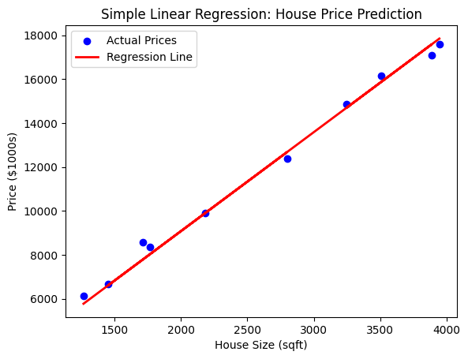
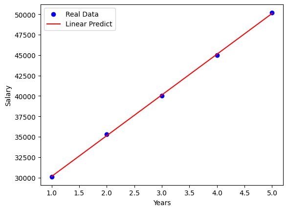

# الانحدار الخطي
## انواعه
- *Linear Regression* – Models the relationship as a straight line (e.g., predicting house prices based on square footage).
- *Multiple Regression* – Extends linear regression by using multiple predictors.
- *Polynomial Regression* – Uses polynomial functions for nonlinear relationships.
- *Logistic Regression* – Used for classification problems, not actual regression.
- *Regularized Regression* – Includes Ridge (L2) and Lasso (L1) regression to prevent overfitting.


```python
import numpy as np
import matplotlib.pyplot as plt
import pandas as pd
from sklearn.linear_model import LinearRegression
from sklearn.model_selection import train_test_split
from sklearn.metrics import mean_squared_error, r2_score

```


### مكتبات اخرى
<details>
  

 
```

استخدام بايثون في تطبيق هذه الموديلات
1. الانحدار الخطي البسيط (Linear Regression)
from sklearn.linear_model import LinearRegression
model = LinearRegression()


2. الانحدار المتعدد (Multiple Linear Regression)
from sklearn.linear_model import LinearRegression
model = LinearRegression()

3. الانحدار المنتظم (Regularized Regression)
الانحدار المنتظم يضيف عقوبة (penalty) لتحسين النموذج ومنع التحايل (overfitting). تشمل الأنواع التالية:

from sklearn.linear_model import Ridge
model = Ridge(alpha=1.0)  # alpha هو معامل العقوبة


from sklearn.linear_model import Lasso
model = Lasso(alpha=0.1)

🔹 الانحدار ElasticNet
الهدف: يجمع بين عقوبات L1 و L2. مفيد عندما تكون لديك بيانات تحتوي على عدد كبير من المتغيرات المتداخلة.
from sklearn.linear_model import ElasticNet
model = ElasticNet(alpha=0.1, l1_ratio=0.5)  # l1_ratio يحدد نسبة العقوبة L1


from sklearn.linear_model import LogisticRegression
model = LogisticRegression()

from sklearn.svm import SVR
model = SVR(kernel='linear')  # يمكن اختيار kernel مختلف مثل 'rbf'

from sklearn.tree import DecisionTreeRegressor
model = DecisionTreeRegressor()

from sklearn.ensemble import RandomForestRegressor
model = RandomForestRegressor(n_estimators=100)

from sklearn.neighbors import KNeighborsRegressor
model = KNeighborsRegressor(n_neighbors=3)

from sklearn.ensemble import GradientBoostingRegressor
model = GradientBoostingRegressor(n_estimators=100)

from xgboost import XGBRegressor
model = XGBRegressor(n_estimators=100)

from sklearn.ensemble import HistGradientBoostingRegressor
model = HistGradientBoostingRegressor()

from sklearn.neural_network import MLPRegressor
model = MLPRegressor(hidden_layer_sizes=(100,), max_iter=1000)

```
</details>


```python
# Simulated dataset: House sizes (sqft) and corresponding prices ($1000s)
np.random.seed(42)
house_size = np.random.randint(500, 4000, 50)  # House size in square feet
house_price = 50 + 4.5 * house_size + np.random.normal(0, 300, 50)  # Price with some noise

# Convert to DataFrame
df = pd.DataFrame({'Size': house_size, 'Price': house_price})

# Split data into training and testing sets
X = df[['Size']]  # Independent variable (feature)
y = df['Price']   # Dependent variable (target)
X_train, X_test, y_train, y_test = train_test_split(X, y, test_size=0.2, random_state=42)

```


```python
df.size
```


    100


```python
X_test
```


<div>
<style scoped>
    .dataframe tbody tr th:only-of-type {
        vertical-align: middle;
    }

    .dataframe tbody tr th {
        vertical-align: top;
    }

    .dataframe thead th {
        text-align: right;
    }

<table border="1" class="dataframe">
  <thead>
    <tr style="text-align: right;">
      <th></th>
      <th>Size</th>
    </tr>
  </thead>
  <tbody>
    <tr>
      <th>13</th>
      <td>3944</td>
    </tr>
    <tr>
      <th>39</th>
      <td>3247</td>
    </tr>
    <tr>
      <th>30</th>
      <td>3885</td>
    </tr>
    <tr>
      <th>45</th>
      <td>3505</td>
    </tr>
    <tr>
      <th>17</th>
      <td>2185</td>
    </tr>
    <tr>
      <th>48</th>
      <td>1767</td>
    </tr>
    <tr>
      <th>26</th>
      <td>1455</td>
    </tr>
    <tr>
      <th>25</th>
      <td>1715</td>
    </tr>
    <tr>
      <th>32</th>
      <td>2800</td>
    </tr>
    <tr>
      <th>19</th>
      <td>1269</td>
    </tr>
  </tbody>
</table>
</div>


```python
y_test
```


    13    17586.663965
    39    14864.830223
    30    17079.512815
    45    16171.930594
    17     9902.497184
    48     8365.151703
    26     6676.545812
    25     8564.303027
    32    12396.974023
    19     6120.767832
    Name: Price, dtype: float64


```python
# Create and train the model
model = LinearRegression()
model.fit(X_train, y_train)

# Get the model parameters
intercept = model.intercept_
slope = model.coef_[0]

print(f"Regression Equation: Price = {intercept:.2f} + {slope:.2f} * Size")

```

    Regression Equation: Price = 39.52 + 4.52 * Size


```python
# Predict house prices
y_pred = model.predict(X_test)

# Evaluate model
mse = mean_squared_error(y_test, y_pred)
r2 = r2_score(y_test, y_pred)

print(f"Mean Squared Error: {mse:.2f}")
print(f"R-squared (R²): {r2:.2f}")

```

    Mean Squared Error: 138043.26
    R-squared (R²): 0.99


```python
plt.scatter(X_test, y_test, color='blue', label="Actual Prices")
plt.plot(X_test, y_pred, color='red', linewidth=2, label="Regression Line")
plt.xlabel("House Size (sqft)")
plt.ylabel("Price ($1000s)")
plt.title("Simple Linear Regression: House Price Prediction")
plt.legend()
plt.show()

```


    

    


```python
from sklearn.ensemble import RandomForestRegressor
X = [[1], [2], [3], [4], [5]]
y = [1, 2, 3, 4, 5]
model = RandomForestRegressor(n_estimators=100)
model.fit(X, y)
predictions = model.predict([[3]])
print(predictions)

```

    [2.71]


### مثال برمجي على الانحدار


```python
import numpy as np
import matplotlib.pyplot as plt
from sklearn.linear_model import LinearRegression

# البيانات
X = np.array([[1], [2], [3], [4], [5]])  # سنوات الخبرة
y = np.array([30100, 35300, 40020, 45000, 50200])  # الرواتب

# بناء النموذج
model = LinearRegression()
model.fit(X, y)

# الحصول على المعاملات
beta_0 = model.intercept_  # التقاطع
beta_1 = model.coef_[0]  # معامل الانحدار

# التنبؤ بالقيم
y_pred = model.predict(X)

# رسم البيانات والنموذج
plt.scatter(X, y, color='blue', label='Real Data')
plt.plot(X, y_pred, color='red', label='Linear Predict')
plt.xlabel('Years')
plt.ylabel('Salary')
plt.legend()
plt.show()

# طباعة المعاملات
print(f"التقاطع (β0): {beta_0}")
print(f"معامل الانحدار (β1): {beta_1}")
#chatGBT Example
```


    

    


    التقاطع (β0): 25154.000000000004
    معامل الانحدار (β1): 4989.999999999999


```python
# البيانات
X = np.array([[1, 3], [2, 4], [3, 5], [4, 6], [5, 7]])  # سنوات الخبرة ودرجة التعليم
y = np.array([30000, 35000, 40000, 45000, 50000])  # الرواتب

# بناء النموذج
model = LinearRegression()
model.fit(X, y)

# الحصول على المعاملات
beta_0 = model.intercept_  # التقاطع
beta_1, beta_2 = model.coef_  # معاملات الانحدار

# التنبؤ بالقيم
y_pred = model.predict(X)

# طباعة المعاملات
print(f"التقاطع (β0): {beta_0}")
print(f"معامل الانحدار لعدد سنوات الخبرة (β1): {beta_1}")
print(f"معامل الانحدار لدرجة التعليم (β2): {beta_2}")

# طباعة التنبؤات
print(f"التنبؤات: {y_pred}")
# فهم جودة النموذج
# حساب R^2
r_squared = model.score(X, y)
print(f"معدل التحديد (R^2): {r_squared}")


```

    التقاطع (β0): 20000.0
    معامل الانحدار لعدد سنوات الخبرة (β1): 2500.0000000000005
    معامل الانحدار لدرجة التعليم (β2): 2500.0
    التنبؤات: [30000. 35000. 40000. 45000. 50000.]
    معدل التحديد (R^2): 1.0


```python
from sklearn.metrics import mean_absolute_error, mean_squared_error, r2_score

# حساب MAE
mae = mean_absolute_error(y, y_pred)
print(f"متوسط الخطأ المطلق (MAE): {mae}")

```

    متوسط الخطأ المطلق (MAE): 0.0


```python
# حساب MSE
mse = mean_squared_error(y, y_pred)
print(f"متوسط مربع الخطأ (MSE): {mse}")

```

    متوسط مربع الخطأ (MSE): 0.0


```python
# حساب RMSE
rmse = np.sqrt(mse)
print(f"جذر متوسط مربع الخطأ (RMSE): {rmse}")

```

    جذر متوسط مربع الخطأ (RMSE): 0.0


```python
from sklearn.linear_model import LinearRegression
import numpy as np

# بيانات العينة: متغيرين مستقلين (x1, x2) ومتغير تابع (y)
X = np.array([[1, 2], [2, 3], [3, 4], [4, 5], [5, 6]])  # مصفوفة المدخلات
y = np.array([5, 7, 9, 11, 13])  # المتغير التابع

# إنشاء نموذج الانحدار
model = LinearRegression()

# تدريب النموذج
model.fit(X, y)

# عرض المعاملات
print(f"المعامل الثابت (β0): {model.intercept_}")
print(f"المعاملات (β1, β2): {model.coef_}")

# التنبؤ بالقيم
y_pred = model.predict(X)
print(f"التنبؤات: {y_pred}")

```

    المعامل الثابت (β0): 2.0
    المعاملات (β1, β2): [1. 1.]
    التنبؤات: [ 5.  7.  9. 11. 13.]


## Ridge and Lasso.


```python
import numpy as np
from sklearn.linear_model import Ridge, Lasso
from sklearn.metrics import mean_squared_error

# بيانات عينة: المتغيرات المستقلة (X) والمتغير التابع (y)
X = np.array([[1, 1], [1, 2], [2, 2], [2, 3]])
y = np.dot(X, np.array([1, 2])) + 3  # y = 1*x1 + 2*x2 + 3

# انحدار Ridge
ridge_model = Ridge(alpha=1.0)  # alpha هو معلمة التنظيم (λ)
ridge_model.fit(X, y)
y_pred_ridge = ridge_model.predict(X)
print("معاملات Ridge:", ridge_model.coef_)
print("المعامل الثابت لـ Ridge:", ridge_model.intercept_)
print("MSE لـ Ridge:", mean_squared_error(y, y_pred_ridge))

# انحدار Lasso
lasso_model = Lasso(alpha=0.5)  # alpha هو معلمة التنظيم (λ)
lasso_model.fit(X, y)
y_pred_lasso = lasso_model.predict(X)
print("معاملات Lasso:", lasso_model.coef_)
print("المعامل الثابت لـ Lasso:", lasso_model.intercept_)
print("MSE لـ Lasso:", mean_squared_error(y, y_pred_lasso))

```

    معاملات Ridge: [0.8 1.4]
    المعامل الثابت لـ Ridge: 4.5
    MSE لـ Ridge: 0.24999999999999956
    معاملات Lasso: [0.  1.5]
    المعامل الثابت لـ Lasso: 5.5
    MSE لـ Lasso: 0.625


التنظيم يساعد في منع التفوق في التكيف من خلال تقليص تأثير المعاملات الكبيرة.

انحدار Ridge (L2) يعمل على تقليص المعاملات نحو الصفر دون جعلها صفرًا تمامًا.

انحدار Lasso (L1) يمكن أن يجعل بعض المعاملات تساوي صفرًا، مما يؤدي إلى اختيار الميزات.


